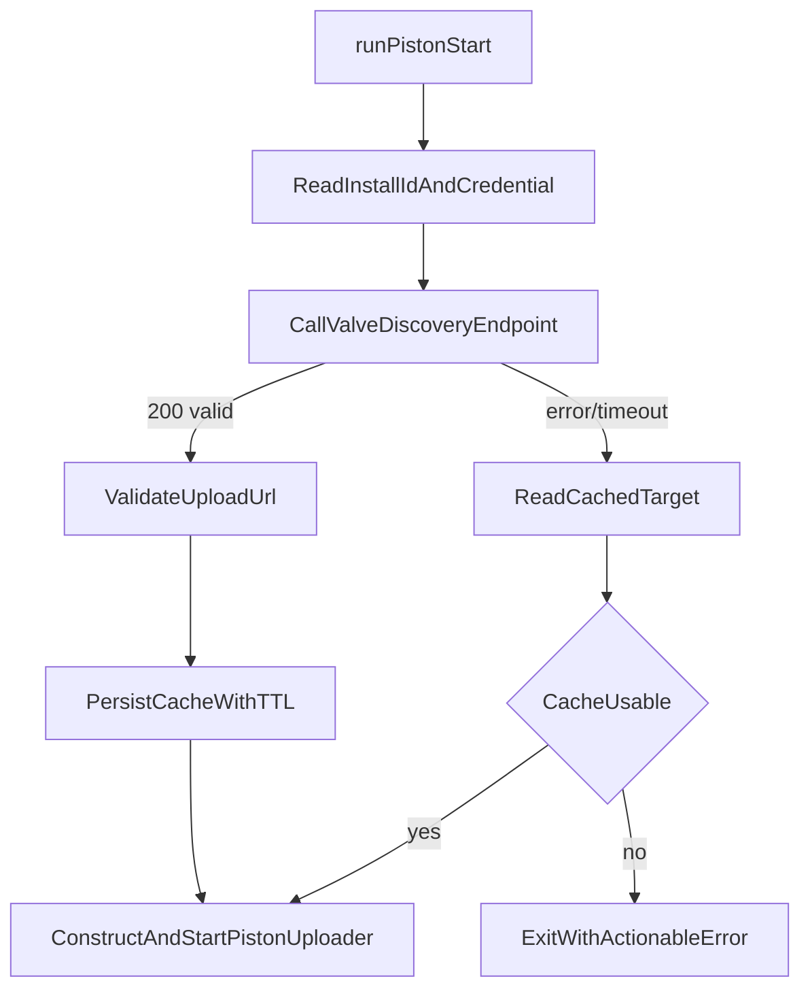

# Piston Repo Plan: Discovery-Driven Upload Target Resolution

## Goal
Update piston startup so it resolves Manifold upload URL dynamically via Valve discovery, caches the last good target with TTL, and starts `PistonUploader` only after a validated endpoint is available.

## Relevant current code
- [`/Users/phil/local/src/piston/Sources/Piston/PistonUploader.swift`](/Users/phil/local/src/piston/Sources/Piston/PistonUploader.swift)
- [`/Users/phil/local/src/piston/Sources/Piston/PistonTypes.swift`](/Users/phil/local/src/piston/Sources/Piston/PistonTypes.swift)
- [`/Users/phil/local/src/piston/README.md`](/Users/phil/local/src/piston/README.md)
- Existing script conventions for deterministic startup behavior:
  - [`/Users/phil/local/src/piston/03_run_security_checks.sh`](/Users/phil/local/src/piston/03_run_security_checks.sh)
  - [`/Users/phil/local/src/piston/04_run_av_checks.sh`](/Users/phil/local/src/piston/04_run_av_checks.sh)

## Design
1. Introduce an upload-target resolver layer used by `05_run_piston` bootstrap:
   - Read provisioned install id/credential from local secure state.
   - Call Valve discovery endpoint.
   - Validate returned `upload_url` (https + allowlist).
2. Add local cache for last known good upload target:
   - Persist `upload_url`, `expires_at`/`ttl_seconds`, and metadata.
   - On startup failure to discover, use unexpired cache; optionally allow stale cache within bounded grace window.
3. Wire resolved URL into `PistonUploader(endpointURL:...)` at startup.
4. Emit deterministic startup logs indicating source of URL (`discovery`, `cache-fresh`, `cache-stale`) and fatal reasons when unresolved.

## Startup Flow

## Implementation steps
- Add new client model types for discovery request/response and cache record.
- Add a discovery HTTP client abstraction (testable like existing `PistonHTTPSession` pattern).
- Add `UploadTargetResolver` that encapsulates:
  - discovery call
  - response validation
  - cache read/write + TTL checks
  - source selection/fallback policy
- Add/implement `05_run_piston` startup script or bootstrap entrypoint to:
  - verify required inputs
  - invoke resolver
  - initialize `PistonUploader` with resolved URL and existing config
  - print deterministic completion/failure lines
- Update README startup example to reflect resolver-based endpoint acquisition.

## Policy defaults (proposed)
- Discovery timeout: short (e.g., 5-10s) with bounded retries + jitter.
- Cache policy:
  - use fresh cache if discovery unavailable
  - optional stale grace window behind explicit flag
- Env override for local/dev only (`MANIFOLD_UPLOAD_URL`) kept as explicit override path and logged.

## Test plan
- Unit tests:
  - valid discovery response resolves URL and writes cache
  - invalid URL/scheme rejected
  - discovery failure + fresh cache succeeds
  - discovery failure + expired cache fails
  - precedence behavior with dev override
- Integration-style tests around startup resolver wiring and uploader construction.
- Script tests for `05_run_piston` deterministic output and non-zero exits on unresolved target.

## Deliverables in this repo
- Resolver + cache implementation.
- `05_run_piston` startup path using resolver.
- Test coverage for fallback and failure modes.
- README docs for runtime configuration and troubleshooting.